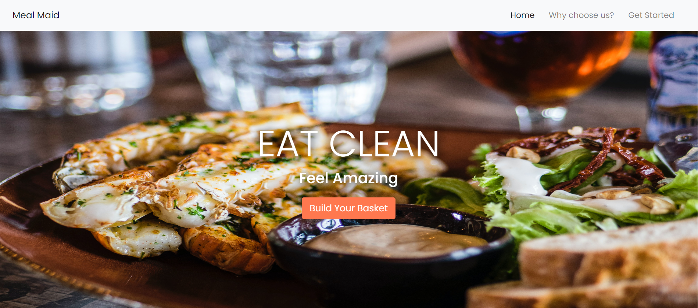

# Meal Maid
-----------
-----------

Meal Maid is Eastern Canada's #1 meal kit service. Made fresh and affordable!

## Project Discription
This project follows a basic web format. Bootstrap is everywhere nowadays, and you may feel as though you have been here (to this site) before. The functionality is very easy to use. Bootstraps nav bar really makes for a smooth transition from page to page. The site is responsive and has media queries for little touchups when viewed from a handheld devices. Colors are softened for user eye protection. I have added some jQuery to the card section on the index page as i felt the effect may be enticing to users.

Meal Maid was created by me (Copyright pending) ;)

## Project Details 
1. Build a static front end project Using the following languages   
    - [x] *HTML5*   
    - [x] *CSS3*   
    - [x] *Bootstrap*
2. Information Architecture   
    - [x] *3 Pages*   
    - [x] *Nav menu using Bootstrap*  
3. Documentation   
    - [x] *README.md file (Explaining what the site is for and what value it provides to the user)*
4. Version Control   
    - [x] *Git & GitHub*  
5. Deployment   
    - [x] *Deploy final version to GitHub pages*

## Built With
This section lists the frameworks I used to built this project.
* [HTML](https://en.wikipedia.org/wiki/HTML)
* [CSS](https://en.wikipedia.org/wiki/CSS)
* [Bootstrap](https://getbootstrap.com)
* [jQuery](https://jquery.com/)
* [Google Fonts](https://fonts.google.com/)
* [Balsamiq](https://balsamiq.com/)

## UX/UI

All photos were edited using Gimp. Trail and error made for an eye catching color scheme throughout the website.
I spent time researching human psychology in regards to decision making and impulse purchasing. Taking this new found information into effect
I made sure to place many call to action sections. All images are property of Unplash.com

## Usage

This project is downloadabe. If you would like to download this repo for personal use, feel free. Steps below:

1. Click the green "Code" button above the file section.
2. Click "Download Zip".
3. Open your downloads file and extract.
4. You set!

## Acknowledgements

* [Code Institute](https://codeinstitute.net/)
* [Canadian Business College](https://canadianbusinesscollege.com/)
* [Unplash](https://unsplash.com/)
* [Hello Fresh](https://www.hellofresh.ca/)
